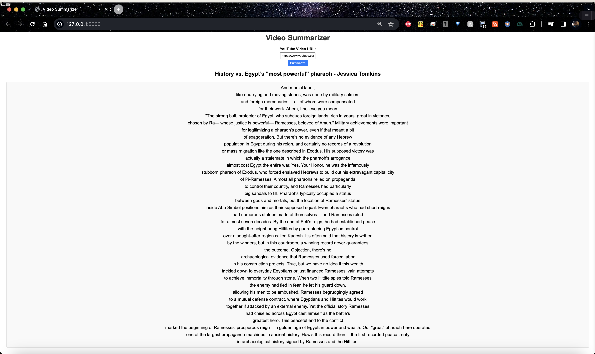

# Youtube-Video-Summarizer  
**️Effortlessly Summarize Lengthy YouTube Videos with a Click**

TLDR; Say goodbye to transcript-scanning marathons!   
This project automates the process of summarizing YouTube videos, delivering the key takeaways in a fraction of the time. ⚡

How It Works:

1. Fetching the Video Transcript: Utilizing the YouTube API, we seamlessly retrieve the video transcript based on the provided URL or video ID.

2. Sentence Tokenization with NLTK: We employ the Natural Language Toolkit (NLTK), a powerful NLP library, to break down the transcript into individual sentences, preparing for in-depth analysis.

3. Key Sentence Extraction: NLTK's sophisticated summarization algorithms take center stage, identifying the most significant sentences using extractive summarization techniques.

4. Concise Summary Creation: The extracted sentences are carefully combined to construct a succinct yet comprehensive summary, capturing the video's core ideas and main arguments.

Key Features:

- Effortlessly extract video transcripts from YouTube.
- Leverage NLTK's powerful sentence tokenization capabilities.
- Generate concise, informative summaries using advanced summarization algorithms.
- Save time and effort by digesting video content efficiently.

